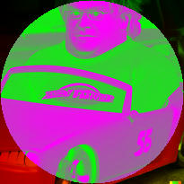

<a name="readme-top"></a>


<br />
<div align="center">
  <a href="https://github.com/michaelgiba/iq">
    
  </a>

<h3 align="center">iq - a little tool for image manipulation</h3>

  <p align="center">
    Inspired by `jq`, iq is an experimental tool for manipulating images.
  </p>
</div>

## Usage

```
iq 0.1.0
michaelgiba@gmail.com

USAGE:
    iq [OPTIONS] [ARGS]

ARGS:
    <input_path>     The path to the input image
    <output_path>    Where to write the output image

OPTIONS:
    -b, --blank <dimensions>    Use a blank canvas of provided size 'HxW' (ex. '100x300')
    -e, --expr <expressions>    The expressions to evaluate
    -f, --file <file>           Pass a file containing expressions to run
    -h, --help                  Print help information
    -V, --version               Print version information
```


## Examples

*Disclaimer:* The tool is a work in progress and in its very early stages. There are certainly bugs and plenty of things to improve.

`iq` is passed an image and a set of expressions and produces an output image. For example:

```
iq -e "_ => p(_.y, _.x, _.r, 0, 0)" assets/dalle_logo.png out.jpg
```

Would produce an output image `out.jpg` with the green and blue color channels removed.

<a href="https://github.com/michaelgiba/iq">

</a>


Expressions can do much more complex actions than simply uniformly changing colors. For example given this DALLE generated image of Philip Seymour Hoffman in the Disney film "Cars":

<a href="https://github.com/michaelgiba/iq">

</a>

### Slice Ranges
We can crop patches of the image using "slice ranges":

```
# Crop out a circle and replace the outside with a gradient
iq -e "[0:100, 0:100]" \
    assets/examples/dalle_philip_seymour_in_cars_movie.jpg \
    cropped_seymour.jpg
```

<a href="https://github.com/michaelgiba/iq">

</a>

### Match Expressions

We can use match expressions to apply other expressions conditionally

```
# Change any pixel with a green channel value greater than 128 to white
iq -e "_.g > 128 => p(_.y, _.x, 255, 255, 255) : _" \
    assets/examples/dalle_philip_seymour_in_cars_movie.jpg \
    highlight_mcqueen.jpg
```
<a href="https://github.com/michaelgiba/iq">

</a>

```
# Crop out a circle and replace the outside with a gradient
iq -e "
    ([].w/2) >= sqrt(sq(_.x - center().x) + sq(_.y - center().y)) =>
        _ :
        p(_.y, _.x, 0, (_.g * _.x) / [].w, 0)
" \
    assets/examples/dalle_philip_seymour_in_cars_movie.jpg \
    circle_seymour.jpg
```
<a href="https://github.com/michaelgiba/iq">

</a>


### Layering

If we provide more than one expression separated by semicolons they will be <a href="https://en.wikipedia.org/wiki/Alpha_compositing">alpha composited together.</a> For example consider this DALLE
generated bottle of ranch testifying in court;

<a href="https://github.com/michaelgiba/iq">

</a>


```
# Superimpose a rotated version on the original;
iq -e "
    _ => p(_.y, _.x, _.r, _.g, _.b, _.a * 0.5);
    _ => p(_.x, _.y, _.r, _.g, _.b, _.a * 0.5);
" \
    assets/examples/dalle_ranch_testifying_in_court.jpg \
    rotate.jpg
```
<a href="https://github.com/michaelgiba/iq">

</a>


### Pixel Functions

There are a few builtin pixel functions like:
- `color_add`
- `color_scale`
- `neighbors`

That when combined with other standard features do even do some convolutions like this sobel edge
detection ranch:

```
# Crop into a circle and do sobel edge detection
iq -e "
  ([].w/2) >= sqrt(sq(_.x - center().x) + sq(_.y - center().y)) => color_norm(color_add(
      color_scale(neighbors(_, -1, -1), -1.0),
      color_scale(neighbors(_,  0, -1), -2.0),
      color_scale(neighbors(_,  1, -1), -1.0),
      color_scale(neighbors(_,  1, -1), 1.0),
      color_scale(neighbors(_,  1,  0), 2.0),
      color_scale(neighbors(_,  1,  1), 1.0)
  ));
" \
    assets/examples/dalle_ranch_testifying_in_court.jpg \
    circle_edge_ranch.jpg
```
<a href="https://github.com/michaelgiba/iq">

</a>


## Language Reference

Coming soon...

## How it works

`iq` is written in `rust` and uses <a href="https://github.com/lalrpop/lalrpop">LALRPOP</a> for parser/lexer generation.


## Installation

Right now the tool is only distributed as source. Clone the repo and do a standard `cargo build`

## Contributing

All contributions are welcome!


## License

Distributed under the MIT License. See `LICENSE.txt` for more information.

<p align="right">(<a href="#readme-top">back to top</a>)</p>

